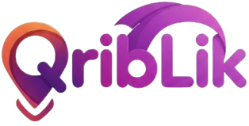

 

  

> **Connect Locally. Exchange Freely.**
>
> A community-driven platform where neighbors discover each other — trade skills, share services, and build real local connections through an interactive map, real-time messaging, and AI-powered publishing.

 

---

 

## Stack

**Core**

**Animation & 3D**

**Data & Services**

**Tooling**

---

 

## Features

 

<table>
  <tr>
    <td width="50%">
      <h3>
        
        &nbsp; Interactive Map
      </h3>
      Explore local offers pinned around you on a live map. Accept an offer and land directly inside a DM with that user — no extra steps.
    </td>
    <td width="50%">
      <h3>
        
        &nbsp; AI Post Creator
      </h3>
      Stuck writing your listing? An integrated AI assistant guides your post creation — faster publishing, better results.
    </td>
  </tr>
  <tr>
    <td>
      <h3>
        
        &nbsp; Real-Time Messaging
      </h3>
      Instant DMs between users. A chatbot assistant lives inside your inbox for quick support — no delays, no dropped responses.
    </td>
    <td>
      <h3>
        
        &nbsp; Rich User Profiles
      </h3>
      Custom avatars, auth-linked data, redeemable rewards, and a full follow system. Click any name on any post — see their card, follow or message instantly.
    </td>
  </tr>
  <tr>
    <td>
      <h3>
        
        &nbsp; Dark Mode — Everywhere
      </h3>
      Full dark mode rolled out across every page, every component, every state. No half-measures.
    </td>
    <td>
      <h3>
        
        &nbsp; Fully Responsive
      </h3>
      From Login to Support, from the Map to Messages — every screen adapts. Pixel-perfect on any device.
    </td>
  </tr>
</table>

 

---

 

## The Team

 

*Eight people. One vision. Built from scratch.*

 

> "Qriblik wasn't just coded — it was argued over, debugged at 2am, redesigned three times, and shipped with pride. This is what happens when a team actually cares."

 

---

 

### Leadership

<table align="center">
  <tr>
    <td align="center" width="160">
      <a href="https://github.com/Anwaroxxx">
        
          
        <b>Anwar Azarzou</b>
      </a>
       
      
        
      
        Map System &amp; Responsiveness 
        AI Post Assistant Integration 
        Map → DM Direct Flow 
        Profile Picture System 
        Profile Cards on Map
      
        
      
    </td>
  </tr>
</table>

 

---

 

### Engineers

 

<table align="center">
  <tr>
    <td align="center" width="160">
      <a href="https://github.com/Hou123ssen">
        
          
        <b>Hussein Doudli</b>
      </a>
       
      
        
      
        Full Website Responsiveness 
        Overview ↔ User DB Linking 
        Post Size Normalization
      
        
      
    </td>
    <td width="32"></td>
    <td align="center" width="160">
      <a href="https://github.com/Hafsa-ouahbi">
        
          
        <b>Hafssa Ouahbi</b>
      </a>
       
      
        
      
        Dark Mode — All Pages 
        Female User Asset Integration 
        Component Styling Overhaul
      
        
      
    </td>
    <td width="32"></td>
    <td align="center" width="160">
      <a href="https://github.com/youssefelkhafif">
        
          
        <b>Youssef Khafif</b>
      </a>
       
      
        
      
        Profile Scroll Bug Fix 
        Redeem Options Debugging 
        Auth ↔ Profile Data Linking
      
        
      
    </td>
  </tr>
</table>

 

<table align="center">
  <tr>
    <td align="center" width="160">
      <a href="https://github.com/GhitaDennoune">
        
          
        <b>Ghita Dennoune</b>
      </a>
       
      
        
      
        Chatbot Response Reliability 
        Inbox Click Delay Fix
      
        
      
    </td>
    <td width="32"></td>
    <td align="center" width="160">
      <a href="https://github.com/meriemjabrane1-etu-cyber">
        
          
        <b>Meriem Jabrane</b>
      </a>
       
      
        
      
        Clickable Profiles on Posts 
        User Detail Card Component 
        Follow &amp; Message Flow
      
        
      
    </td>
    <td width="32"></td>
    <td align="center" width="160">
      <a href="https://github.com/Aymen-chakir">
        
          
        <b>Aymen Chakir</b>
      </a>
       
      
        
      
        Notification Card System
      
        
      
    </td>
  </tr>
</table>

 

<table align="center">
  <tr>
    <td align="center" width="160">
      <a href="https://github.com/Hamza-Abouelwahab">
        
          
        <b>Hamza Abouelwahab</b>
      </a>
       
      
        
      
        Browser Tab Favicon 
        About Page Redesign 
        Navbar &amp; Footer Logic 
        Bug Detection &amp; Reporting
      
        
      
    </td>
  </tr>
</table>

 

---

 

## What We Learned

This project was never just about building a web app. It was about learning how to build things *together* — which turned out to be the harder challenge.

**Working as a team is a skill of its own.** Eight people, eight opinions, eight different ways of writing code. We had to agree on conventions, on structure, on what "done" actually means. That kind of alignment doesn't come automatically — it takes conversations, compromises, and a lot of patience. We learned that the best teams aren't the ones who never disagree, they're the ones who disagree well.

**Git conflicts are just people conflicts in disguise.** When two teammates modify the same file, git shows you a merge conflict. But really, what it's showing you is two people who both cared enough to work on the same thing. We learned to resolve those conflicts calmly — read both versions, understand what each person was trying to do, and find the solution that respects both. On the code side and the human side.

**Managing chaos is a real discipline.** There were days where three things were broken at once, someone's branch was two days behind, and the deadline was the next morning. We learned to stay calm under pressure, triage problems by priority, divide responsibilities clearly, and trust each other to handle their part. Panic is expensive. Focus is free.

**Communication saves more time than any tool.** A two-minute conversation about what a component is supposed to do saves two hours of debugging why it doesn't. We got better at writing clear commit messages, asking precise questions, and flagging blockers early instead of suffering in silence.

**Ownership matters.** When everyone is responsible for everything, nothing gets done. When each person owns a clear piece, things ship. We learned to define boundaries, respect each other's territory, and ask before touching someone else's work.

**Bugs are the best teachers.** The chatbot that refused to respond. The map card that wouldn't redirect. The scroll that locked on profile. Every single bug forced us to understand our own code more deeply than any tutorial ever could. Debugging is where you stop following instructions and start actually thinking.

**The product is always bigger than any one of us.** There were moments where someone's feature had to wait, or be changed, or removed entirely — because it wasn't what the product needed. We learned to detach from our own work just enough to ask "does this actually make Qriblik better?" That's a hard question when you spent two days on something. But it's the right one.

Qriblik is the result of all of that. Not eight people writing code in the same repo — eight people becoming better developers, better collaborators, and better at shipping real things into the world.

 

---

 

## License

 

 

**Copyright © 2025 Anwar Azarzou & the Qriblik Team. All rights reserved.**

This repository and all of its contents — including but not limited to source code, design assets, UI components, business logic, configuration files, and documentation — are the exclusive intellectual property of the Qriblik team.

**The following are strictly prohibited without prior written permission from the copyright holders:**

- Using, running, or deploying this software in any environment
- Copying, reproducing, or distributing any part of this codebase
- Modifying, adapting, translating, or building derivative works
- Extracting components, logic, designs, or assets for use in other projects
- Sublicensing, selling, or commercially exploiting any part of this project
- Reverse engineering or attempting to reconstruct the application's architecture

This repository is made publicly visible **for portfolio and academic presentation purposes only.** Public visibility on GitHub does not constitute an open-source license, a grant of permission, or a waiver of any intellectual property rights.

Unauthorized use of any part of this codebase may constitute copyright infringement and may be subject to legal action under applicable national and international law.

For licensing inquiries or permissions, contact the team lead: **[github.com/Anwaroxxx](https://github.com/Anwaroxxx)**

 

---

 

  

Built in Morocco &nbsp;·&nbsp; 2025 &nbsp;·&nbsp; All Rights Reserved

 

